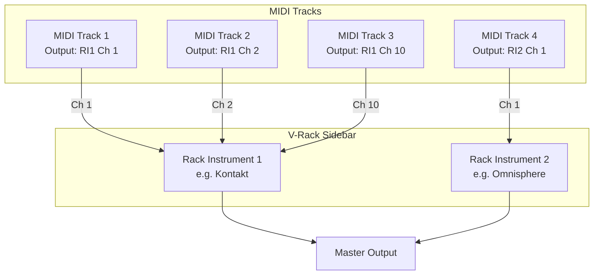
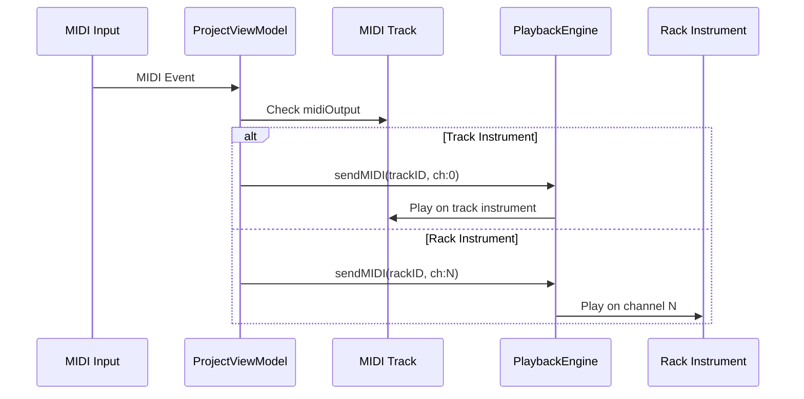

# V-Rack Multi-Channel MIDI Instrument Hosting

## Architecture Overview



## Data Model Changes

### 1. New V-Rack Model

Create [DAWCore/Sources/DAWCore/Models/VRack.swift](DAWCore/Sources/DAWCore/Models/VRack.swift):

```swift
public struct RackInstrument: Identifiable, Codable {
    public var id: UUID
    public var name: String
    public var pluginSlot: PluginSlot
    public var volume: Float
    public var isMuted: Bool
}

public struct VRack: Codable {
    public var instruments: [RackInstrument]
}
```

### 2. Update Track Model

Modify [DAWCore/Sources/DAWCore/Models/Track.swift](DAWCore/Sources/DAWCore/Models/Track.swift):

```swift
// Add to Track struct:
public var midiOutput: MIDIOutputDestination?

public enum MIDIOutputDestination: Codable {
    case trackInstrument           // Use track's own instrument slot
    case rackInstrument(id: UUID, channel: UInt8)  // Route to V-Rack
}
```

### 3. Update Project Model

Add V-Rack to [DAWCore/Sources/DAWCore/Models/Project.swift](DAWCore/Sources/DAWCore/Models/Project.swift):

```swift
public var vRack: VRack = VRack(instruments: [])
```

## Audio Engine Changes

### 4. PlaybackEngine Updates

Modify [DAWCore/Sources/DAWCore/Audio/PlaybackEngine.swift](DAWCore/Sources/DAWCore/Audio/PlaybackEngine.swift):

- Add `rackInstruments: [UUID: TrackInstrument]` dictionary
- Add `loadRackInstrument(_:pluginID:)` method
- Add `removeRackInstrument(_:)` method
- Update `sendMIDIToTrack()` to check `midiOutput` destination and route accordingly
- Route to rack instrument on specified channel (1-16)

## UI Components

### 5. V-Rack Sidebar Panel

Create [DAWUI/Sources/DAWUI/Views/VRack/VRackView.swift](DAWUI/Sources/DAWUI/Views/VRack/VRackView.swift):

- List of rack instruments with:
  - Instrument name and plugin
  - Add/remove buttons
  - Volume/mute controls
  - Click to open plugin UI
- "+" button to add new rack instrument
- Plugin browser integration

### 6. Track Header MIDI Output Selector

Update [DAWUI/Sources/DAWUI/Views/Timeline/TrackHeaderView.swift](DAWUI/Sources/DAWUI/Views/Timeline/TrackHeaderView.swift):

- Add compact dropdown showing current output (e.g., "Kontakt Ch 1")
- Menu with:
  - "Track Instrument" option (default)
  - List of rack instruments, each with submenu for channels 1-16

### 7. Inspector MIDI Output Section

Update Inspector in [DAWUI/Sources/DAWUI/Views/MainWindowView.swift](DAWUI/Sources/DAWUI/Views/MainWindowView.swift):

- Add "MIDI Output" section for MIDI/instrument tracks
- Dropdown for destination selection
- Channel picker (1-16)

### 8. Main Window Layout

Update [DAWUI/Sources/DAWUI/Views/MainWindowView.swift](DAWUI/Sources/DAWUI/Views/MainWindowView.swift):

- Add V-Rack sidebar panel (collapsible)
- Toggle button in toolbar to show/hide V-Rack

## ViewModel Updates

### 9. ProjectViewModel

Update [DAWUI/Sources/DAWUI/ViewModels/ProjectViewModel.swift](DAWUI/Sources/DAWUI/ViewModels/ProjectViewModel.swift):

- Add rack instrument management methods:
  - `addRackInstrument()`
  - `removeRackInstrument(_:)`
  - `loadRackInstrumentPlugin(_:pluginID:)`
- Update `routeMIDIToInstrument()` to handle rack routing
- Update playback preparation to load rack instruments

## MIDI Routing Flow



## File Summary

| File | Action |

|------|--------|

| `DAWCore/.../Models/VRack.swift` | Create |

| `DAWCore/.../Models/Track.swift` | Modify |

| `DAWCore/.../Models/Project.swift` | Modify |

| `DAWCore/.../Audio/PlaybackEngine.swift` | Modify |

| `DAWUI/.../Views/VRack/VRackView.swift` | Create |

| `DAWUI/.../Views/Timeline/TrackHeaderView.swift` | Modify |

| `DAWUI/.../Views/MainWindowView.swift` | Modify |

| `DAWUI/.../ViewModels/ProjectViewModel.swift` | Modify |